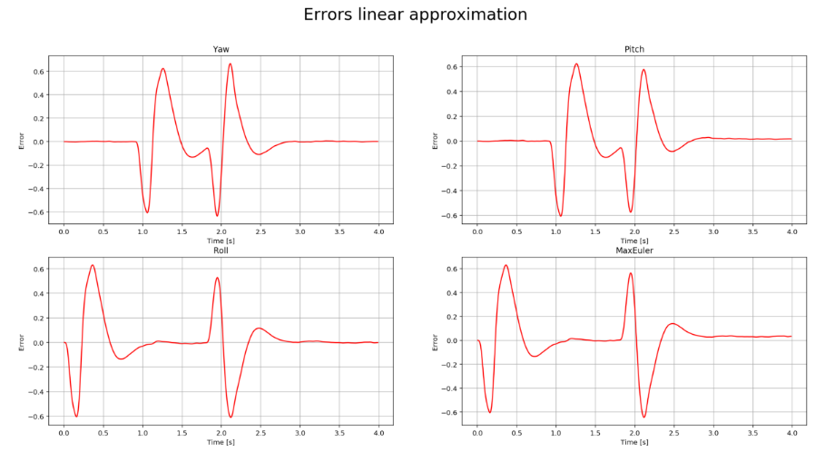
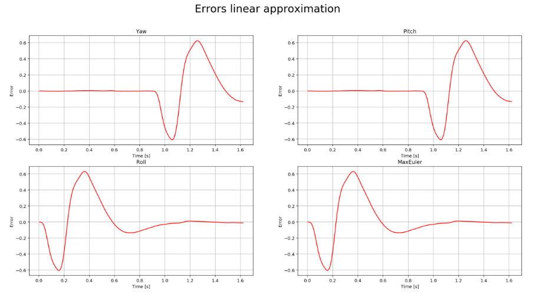
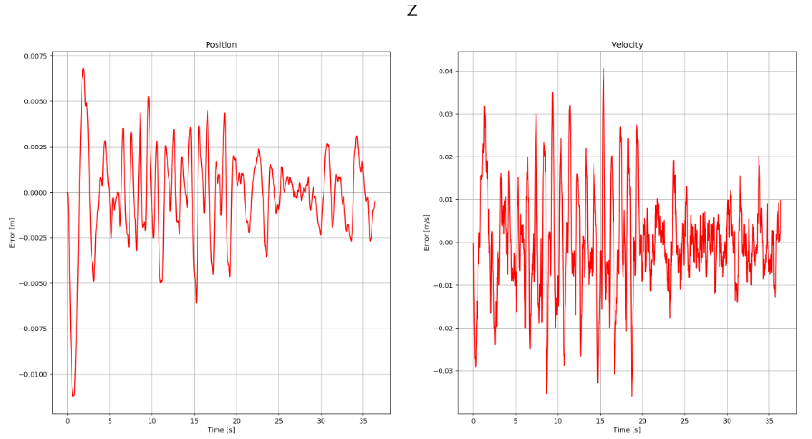
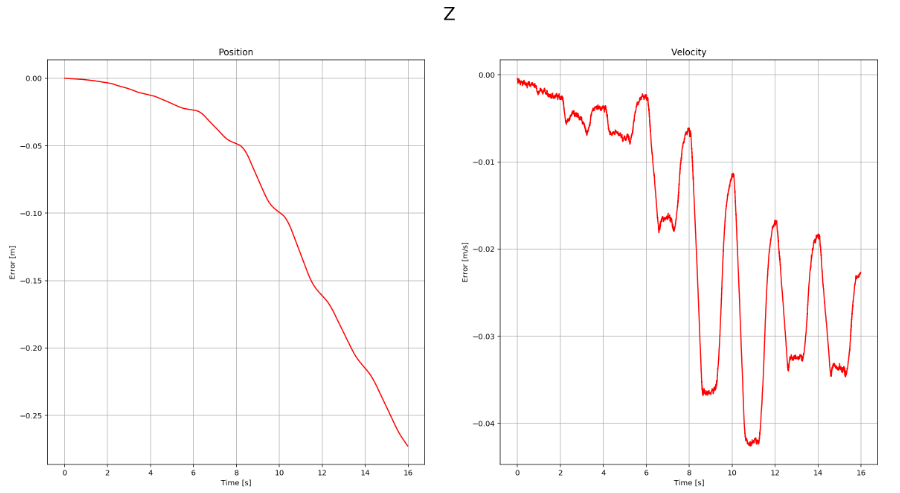
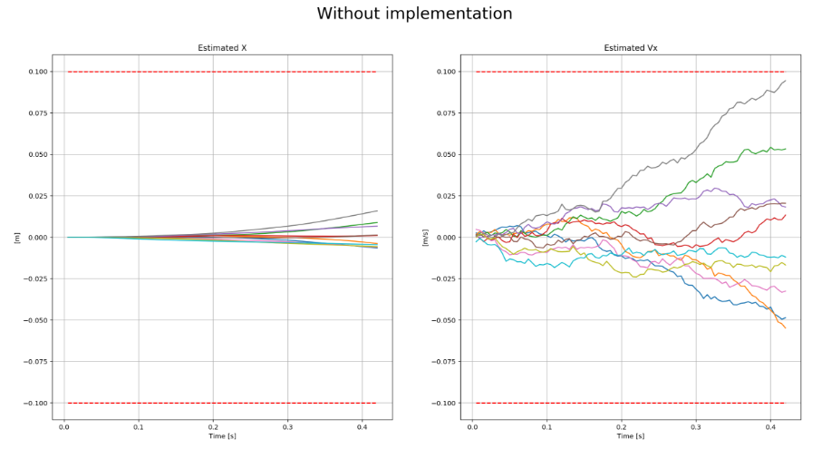
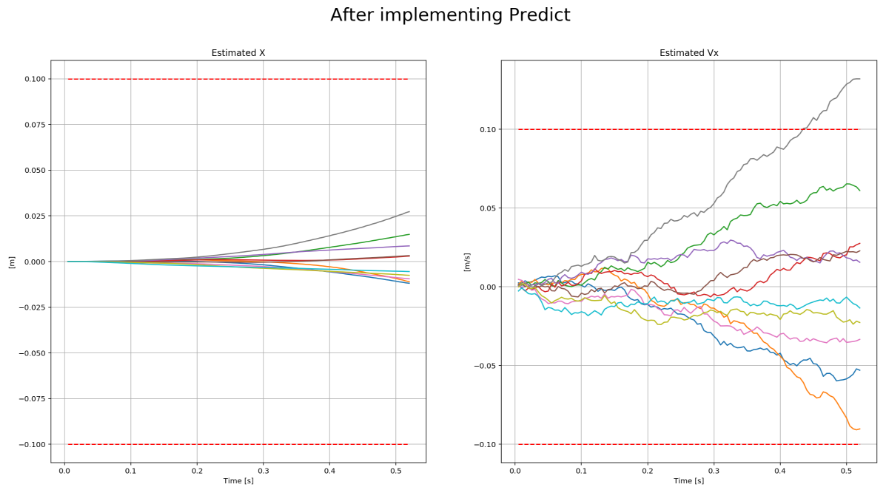
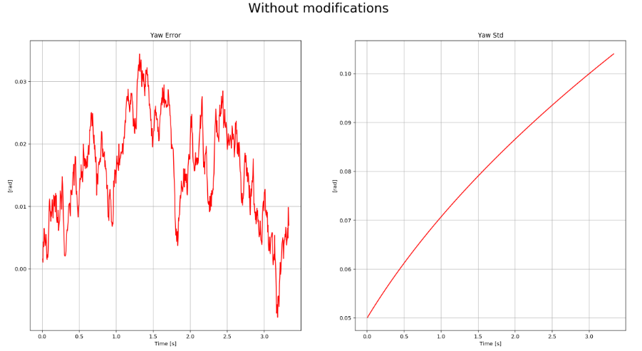
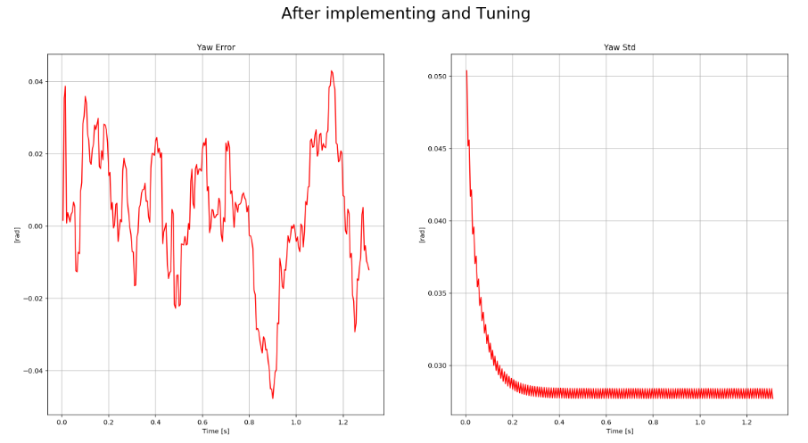
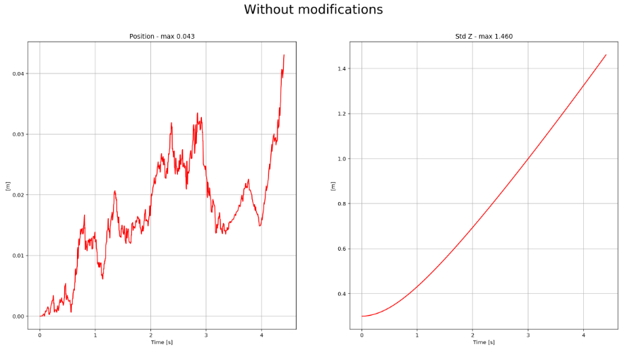
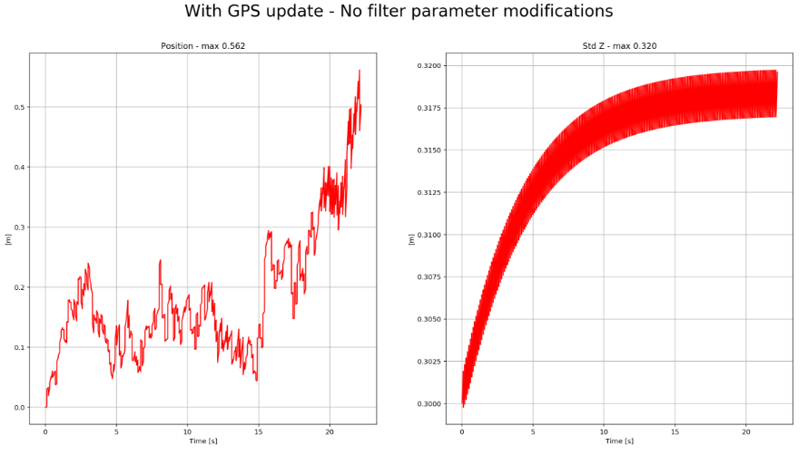

# Estimation Project #


###The Tasks ###

In this project, We are asked to build up an estimator in pieces.  The details of steps I took are explained below.

 **Step 1:** *Sensor Noise*

After choosing  scenario `06_NoisySensors`, I run the simulation for once to collect noisy sensor data and used  logs from `config/log/Graph1.txt` (GPS X data) and `config/log/Graph2.txt` (Accelerometer X data) files to calculate sandard deviations.

I used below code to process the logged files to figure out the standard deviation of the the GPS X signal and the IMU Accelerometer X signal.


~~~
import numpy as np

# Reading from the logs
gps_x  = np.loadtxt('./config/log/Graph1.txt',delimiter=',',dtype='Float64',skiprows=1)[:,1]
acc_x = np.loadtxt('./config/log/Graph2.txt',delimiter=',',dtype='Float64',skiprows=1)[:,1]

#Calculating standard deviations
gps_x_std  = np.std(gps_x)
print(f'GPS X Std: {gps_x_std}')
acc_x_std = np.std(acc_x)
print(f'Accelerometer X Std: {acc_x_std}')
~~~
the results:
```
GPS X Std: 0.6601210006202937
Accelerometer X Std: 0.48276365150441797
```

I Plug in my result into the top of `config/6_Sensornoise.txt` by 
 setting the values as

 `MeasuredStdDev_GPSPosXY = 0.660 `
 
 `MeasuredStdDev_AccelXY = 0.482`
 
 I thought it would be enough to include up to 3 decimal places for the both deviations to include. If my scnerio didn't pass I was going to include more decimal places to set the values.

***Success criteria:*** 
The below prints on the console meaning I met the success criteria.

```
PASS: ABS(Quad.IMU.AX-0.000000) was less than MeasuredStdDev_AccelXY for 67% of the time
```

  **Step 2: ** *Attitude Estimation*

We are looking at the first step to our state estimation: including information from our IMU.  In this step, we will be improving the complementary filter-type attitude filter with a better rate gyro attitude integration scheme.

I added  `Commands += AddGraph1.LogToFile` and `Commands += AddGraph2.LogToFile` to `07_AttitudeEstimation` file to collect dat to log files. Then I draw the graphs before and after I made changes required to complete this step. The code I used is below : 

~~~
import numpy as np
import matplotlib.pyplot as plt

%matplotlib inline 
%config InlineBackend.figure_format = 'retina'


# time, Quad.Est.E.Yaw, Quad.Est.E.Pitch, Quad.Est.E.Roll, Quad.Est.E.MaxEuler# time, 
graph1 = np.loadtxt('./config/log/Graph1.txt',delimiter=',',dtype='Float64',skiprows=1)

# time, Quad.Est.E.Yaw, Quad.Est.E.Pitch, Quad.Est.E.Roll, Quad.Est.E.MaxEuler
no_code_graph1 = np.loadtxt('./config/log/Graph2.txt',delimiter=',',dtype='Float64',skiprows=1)

def plotErrors(data, title):
    """
    Plots the estimation errors on yaw, pith, roll and max euler
    """
    time = data[:, 0]
    sub_titles = ['Yaw', 'Pitch', 'Roll', 'MaxEuler']
        
    fig, axes = plt.subplots(2, 2, figsize=[20,10])
    
    for ax, index, sub_title in zip(axes.flat, range(4), sub_titles):
        values = data[:, index + 1]
        ax.plot(time, values, 'r')
        ax.set_xlabel('Time [s]')
        ax.set_ylabel('Error')
        ax.grid()
        ax.set_title(sub_title)
    
    plt.suptitle(title, fontsize=24)

plotErrors(no_code_graph1, 'Errors linear approximation')
~~~


*The plots above generated before we made the changes*

 There are two plots visible in this simulation.
   - The top graph is showing errors in each of the estimated Euler angles.
   - The bottom shows the true Euler angles and the estimates.
Observe that there’s quite a bit of error in attitude estimation.

From `QuadEstimatorEKF.cpp` file I updated the function `UpdateFromIMU()` The key difference is I calculated "agle_dot" by adding `V3F angle_dot = rot * gyro;` line and used it to predict Roll and Pitch instead of using the value come from gyro only. 

*The plots above generated before we made the changes*

***Success criteria:*** 

The below prints on the console meaning I met the success criteria.
```
PASS: ABS(Quad.Est.E.MaxEuler) was less than 0.100000 for at least 3.000000 seconds
```

**Step 3:** *Prediction Step*

I also added  `Commands += AddGraph1.LogToFile` and `Commands += AddGraph2.LogToFile` to `08_PredictState` and `09_PredictCovariance` file to collect data to log files. Then I draw the graphs before and after I made changes required to complete this step. The code I used is below to plot the logs :

~~~
import csv
import numpy as np

import matplotlib.pyplot as plt

%matplotlib inline 
%config InlineBackend.figure_format = 'retina'

# time, Quad.Pos.Y, Quad.Est.Y, Quad.Vel.Y, Quad.Est.VY
no_code_graph1 = np.loadtxt('./config/log/Graph1.txt',delimiter=',',dtype='Float64',skiprows=1)
# time, Quad.Pos.Z, Quad.Est.Z, Quad.Vel.Z, Quad.Est.VZ
no_code_graph2 = np.loadtxt('./config/log/Graph2.txt',delimiter=',',dtype='Float64',skiprows=1)

def plotPositionAndVelocity(data,indexPosition, indexVelocity, title):
    """
    Plots the position with index `indexPosition` and the velocity with index `indexVelocity`.
    It assumes the estimations are +1 the index of the values.
    """
    time = data[:, 0]
    
    trueP = data[:, indexPosition]
    estP = data[:, indexPosition + 1]
    
    fig, axes = plt.subplots(1, 2, figsize=[20,10])
    axP = axes[0]
    axP.plot(time, trueP - estP, 'r')
    axP.set_xlabel('Time [s]')
    axP.set_ylabel('Error [m]')
    axP.grid()
    axP.set_title('Position')
    
    
    trueV = data[:, indexVelocity]
    estV = data[:, indexVelocity + 1]
    
    axV = axes[1]
    axV.plot(time, (trueV - estV), 'r')
    axV.set_xlabel('Time [s]')
    axV.set_ylabel('Error [m/s]')
    axV.grid()
    axV.set_title('Velocity')
    
    plt.suptitle(title, fontsize=24)

plotPositionAndVelocity(no_code_graph2, 1, 3, "Z")
~~~

*The plot above is generated before we made any changes*

After implementing the state prediction step in the `PredictState()` function.

*The plot above is generated after we complete PredictState function*



*The plot above is generated before we made any changes to GetRgbPrime*



*The plot above is generated after we made any changes to GetRgbPrime*

***Success criteria:*** *This step doesn't have any specific measurable criteria being checked.*


**Step 4:** *Magnetometer Update*

I also added  `Commands += AddGraph1.LogToFile` and `Commands += AddGraph2.LogToFile` to `10_MagUpdate` file to collect data to log files. Then I draw the graphs before and after I made changes required to complete this step. The code I used is below to plot the logs :

~~~
import numpy as np
import matplotlib.pyplot as plt

%matplotlib inline 
%config InlineBackend.figure_format = 'retina'

# time, Quad.MagYaw, Quad.Est.Yaw, Quad.Yaw
no_code_graph1 = np.loadtxt('./config/log/Graph1.txt',delimiter=',',dtype='Float64',skiprows=1)
# time, Quad.Est.E.Yaw, Quad.Est.S.Yaw
no_code_graph2 = np.loadtxt('./config/log/Graph2.txt',delimiter=',',dtype='Float64',skiprows=1)


def  plotYawError(data, title):
    """
    Plots the Yaw error
    """
    time = data[:, 0]
    values = [data[:,1], data[:, 2]]
    subtitles = ['Yaw Error', 'Yaw Std']
    fig, axes = plt.subplots(1, 2, figsize=[20,10])
    for ax, subtitle, value in zip(axes.flat, subtitles, values):
        ax.plot(time, value, 'r')
        ax.set_xlabel('Time [s]')
        ax.set_ylabel('[rad]')
        ax.set_title(subtitle)
        ax.grid()
        
    plt.suptitle(title, fontsize=24)

plotYawError(no_code_graph2, 'Without modifications')
~~~


*The plot above is generated before we made any changes to UpdareFromMag() function*

Before tuning `QYawStd` parameter from`QuadEstimatorEKF.txt` file.
```
PASS: ABS(Quad.Est.E.Yaw) was less than 0.120000 for at least 10.000000 seconds
FAIL: ABS(Quad.Est.E.Yaw-0.000000) was less than Quad.Est.S.Yaw for 45% of the time
```

*The plot above is generated after  we made any changes to UpdareFromMag() function and tuneQYawStd parameter*


***Success criteria:*** 
Below print from the console means I met the success criteria.
```
PASS: ABS(Quad.Est.E.Yaw) was less than 0.120000 for at least 10.000000 seconds
PASS: ABS(Quad.Est.E.Yaw-0.000000) was less than Quad.Est.S.Yaw for 57% of the time
```


**Step 5:** *Closed Loop + GPS Update*

I also added  `Commands += AddGraph1.LogToFile` and `Commands += AddGraph2.LogToFile` to `11_GPSUpdate` file to collect data to log files. Then I draw the graphs before and after I made changes required to complete this step. The code I used is below to plot the logs :

~~~
import numpy as np
import matplotlib.pyplot as plt

%matplotlib inline 
%config InlineBackend.figure_format = 'retina'


# time, Quad.Pos.Y, Quad.Est.Y, Quad.Vel.Y, Quad.Est.VY# time, 
no_code_graph1 = np.loadtxt('./config/log/Graph1.txt',delimiter=',',dtype='Float64',skiprows=1)
# time, Quad.Est.E.Pos, Quad.Est.S.Z
no_code_graph2 = np.loadtxt('./config/log/Graph2.txt',delimiter=',',dtype='Float64',skiprows=1)


def  plotErrors (data, title):
    """
    Plots the Yaw error
    """
    time = data[:, 0]
    values = [data[:,1], data[:, 2]]
    subtitles = ['Position', 'Std Z']
    fig, axes = plt.subplots(1, 2, figsize=[20,10])
    for ax, subtitle, value in zip(axes.flat, subtitles, values):
        ax.plot(time, value, 'r')
        ax.set_xlabel('Time [s]')
        ax.set_ylabel('[m]')
        ax.set_title(f'{subtitle} - max {np.max(np.absolute(value)):.3f}')
        ax.grid()
        
    plt.suptitle(title, fontsize=24)

plotErrors(no_code_graph2, 'Without modifications')
~~~

*The plot above is generated before we made any changes to config/11_GPSUpdate.tx or update `UpdateFromGPS()` function*



*The plot above is generated before we made any changes to config/11_GPSUpdate.tx or update `UpdateFromGPS()` function*

***Success criteria:***
Below print from the console means I met the success criteria.

```
PASS: ABS(Quad.Est.E.Pos) was less than 1.000000 for at least 20.000000 seconds
```

**Step 6:** *Adding Your Controller*

Changes to the `11_GPSUpdate` file and log function is the same function we used at step 5.

After replacing the `QuadController.cpp` and `QuadControlParams.txt `files.
The scnerio passes 

```
PASS: ABS(Quad.Est.E.Pos) was less than 1.000000 for at least 20.000000 seconds
```
Before Tuning:
 

After Tuning:


***Success criteria:*** 
Below print from the console means I met the success ciriteria.
```
PASS: ABS(Quad.Est.E.Pos) was less than 1.000000 for at least 20.000000 seconds

```