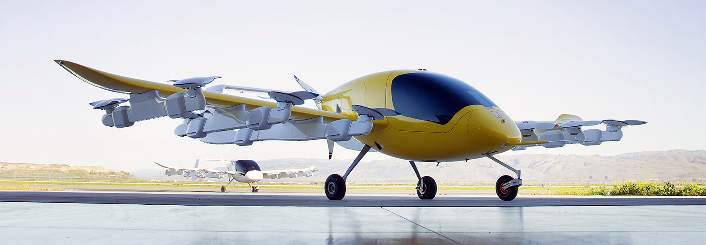

# Flying Cars #

A flying car is a type of personal air vehicle or roadable aircraft that provides door-to-door transportation by both ground and air.  Just like **Cora** which is designed by **Kitty Hawk**.

You can learn more about **Cora** and **Kitty Hawk** by visiting their website

- [Cora](https://cora.aero/)
- [Kitty Hawk](https://kittyhawk.aero/)

This repository is built to showcase completed classroom projects of [Flying Car Nanodegree](https://www.udacity.com/course/flying-car-nanodegree--nd787) offered by [Udacity](https://www.udacity.com/)

This README is broken down into the following sections:
 
 - [Backyard Flyer](#backyard-flyer)
 - [3D Motion Planning](#3d-motion-planning)
 - [Building a Controller](#building-a-controller)
 - [Building an Estimator](#building-an-estimator)

## Backyard Flyer ##
***Make a simulated drone fly in a square shape!***

In this project, we have written the **"Hello, world!"** of drone programming as we write event-driven code that causes a  quadrotor to take off, fly in a square, and land.

This project is the first project of Flying Car Nanodegree as an exercise of *Introduction to Autonomous Flight* section of the program.You can find more information about the implementation steps of this project on the project's own [README](/Backyard-Flyer/README.md) file. Also, You can visit the project's original [repository](https://github.com/udacity/FCND-Backyard-Flyer) for further information.

**My Solution**
- [Solution](Backyard-Flyer/backyard_flyer_solution.py)

## 3D Motion Planning ##
In this project, we've got a chance to apply what we've learned about **3D motion planning** from the *Planning* section classes to plan and execute a mission in a complex urban environment!

You can find more information about the implementation steps of this project on the project's own [README](Motion-Planning/README.md) file. Also, You can visit the project's original [repository](https://github.com/udacity/FCND-Motion-Planning) for further information.

**My Solution**
- [Solution](/Motion-Planning/planning_utils_solution.py)
- [Solution Write-up](/Motion-Planning/FCND-Motion_Planning.pdf)

## Building a Controller ##

In this project, we've implemented a controller for a quadrotor in C++. Experimented on building **PID Controller** and **3D Dynamics** of a quadcopter.

You can find more information about the implementation steps of this project on the project's own [README](/Controls/README.md) file. Also, You can visit the project's original [repository](https://github.com/udacity/FCND-Controls) for further information.

**My Solution**
- [Solution](/Controls/src/QuadControl.cpp)
- [Solution Write-up](/Controls/report2.pdf)
## Building an Estimator ##

In this project we've implemented an estimator to track the position and attitude of a quadrotor moving in three dimensions. Experimented on **Kalman Filters** **Estimation and Localization**.

You can find more information about the implementation steps of this project on the project's own [README](/Estimation/README.md) file. Also, You can visit the project's original [repository](https://github.com/udacity/FCND-Estimation-CPP) for further information.

**My Solution**
- [Solution](/Estimation/src/QuadEstimatorEKF.cpp)
- [Solution Write-up](/Estimation/report/report.md)
